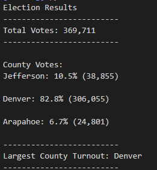
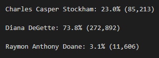
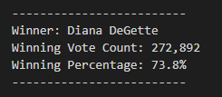

# Election Analysis

## Overview of Election Audit
Purpose of this election audit is to confirm the winner and county by counting the respective votes. 

## Election-Audit Results

- How many votes were cast in this congressional election? 

	A total of 369,711 votes were cast in the congressional election. 

- Provide a breakdown of the number of votes and the percentage of total votes for each county in the precinct.
	
	
	Jefferson had 10.5% of total votes at 38,855 votes.

	Denver had 82.8% of total votes at 306,055 votes. 

	Arapahoe had 6.7% of total votes at 24,801 votes. 

- Which county had the largest number of votes?

	Denver had the largest number of votes at 306,055
- Provide a breakdown of the number of votes and the percentage of the total votes each candidate received.
	
	
	Stockham had 23.0% of total votes at 85,213 votes.

	DeGette had 73.8% of total votes at 272,892 votes. 

	Doane had 3.1% of total votes at 11,606 votes.
- Which candidate won the election, what was their vote count, and what was their percentage of the total votes?
	
	
	Diana DeGette won the lection with 73.8% of total votes at 272,892 votes.

## Election-Audit Summary 
This script can be used again generate the results with any different election. But variables (headers, list, and dictionary) will change when collecting more data for bigger elections. Depending on the file name, the file path will have to change as well. 
